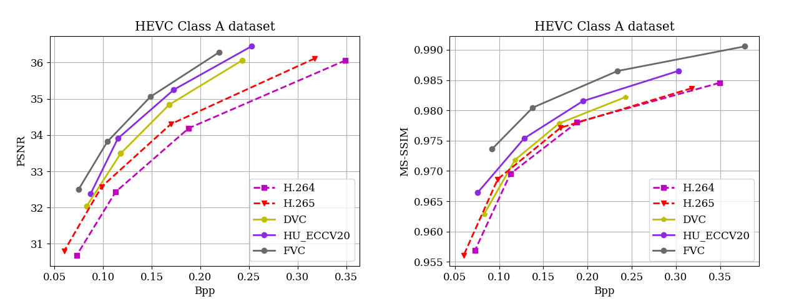
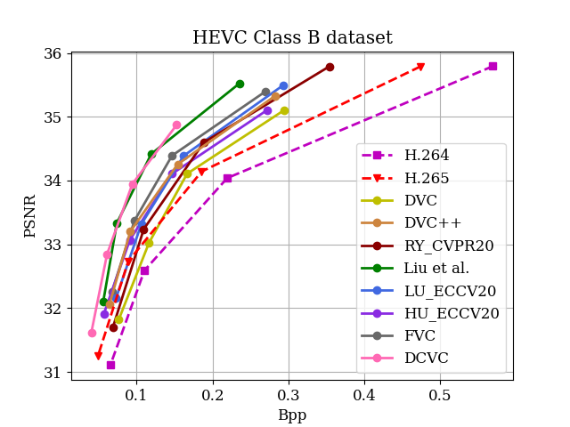
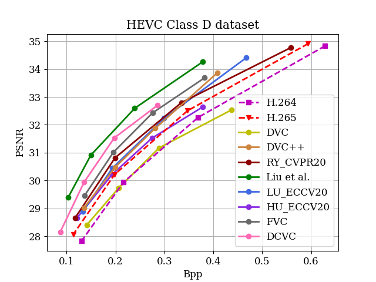
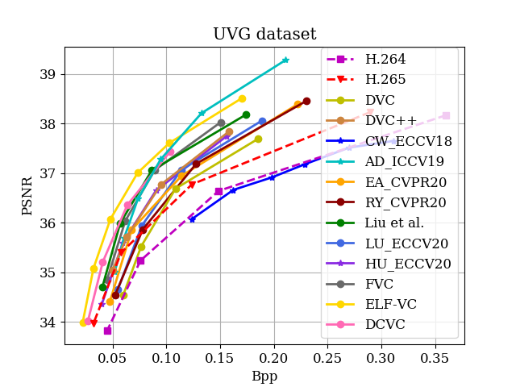
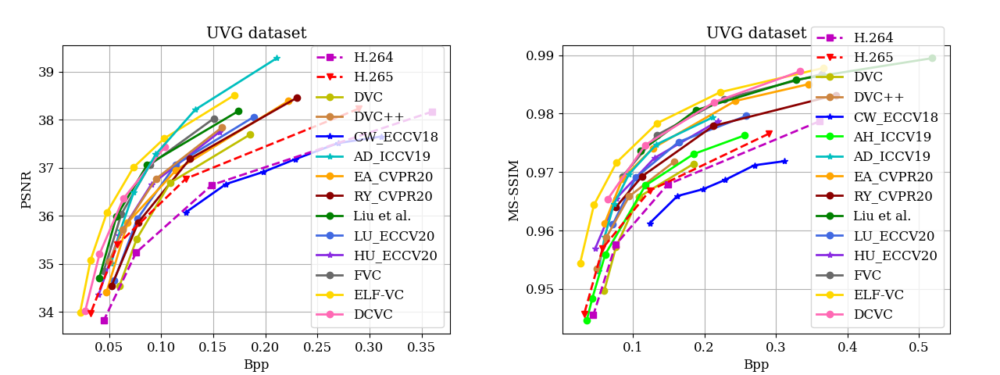
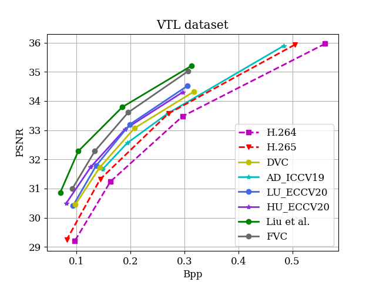

# Benchmark of Video Compression


## Methods
- <font color="#0343df">CW_ECCV18</font> : [Video Compression through Image Interpolation](https://arxiv.org/abs/1804.06919)
- <font color="#c2bd1c">DVC</font> : [DVC: An End-to-end Deep Video Compression Framework](https://arxiv.org/abs/1812.00101)
- <font color="#CD853F">DVC++</font> : [An End-to-End Learning Framework for Video Compression](https://ieeexplore.ieee.org/document/9072487)
- <font color="#00bfbf">AD_ICCV19</font> : [Neural Inter-Frame Compression for Video Coding](https://openaccess.thecvf.com/content_ICCV_2019/papers/Djelouah_Neural_Inter-Frame_Compression_for_Video_Coding_ICCV_2019_paper.pdf)
- <font color="#00FF00">AH_ICCV19</font> : [Video CompressionWith Rate-Distortion Autoencoders](https://arxiv.org/abs/1908.05717v2)
- <font color="#008000">EA_CVPR20</font> : [Scale-space Flow for End-to-end Optimized Video Compression](https://openaccess.thecvf.com/content_CVPR_2020/papers/Agustsson_Scale-Space_Flow_for_End-to-End_Optimized_Video_Compression_CVPR_2020_paper.pdf)
- <font color="#8B0000">RY_CVPR20</font> : [Learning for Video Compression with Hierarchical Quality and Recurrent Enhancement](https://arxiv.org/pdf/2003.01966.pdf)
- <font color="#8A2BE2">HU_ECCV20</font> : [Improving Deep Video Compression by Resolution-adaptive Flow Coding](http://www.ecva.net/papers/eccv_2020/papers_ECCV/papers/123470188.pdf)
- <font color="#696969">FVC</font> : [FVC: A New Framework towards Deep Video Compression in Feature Space](https://arxiv.org/pdf/2105.09600.pdf)
- <font color="#4169E1">LU_ECCV20</font> : [Content Adaptive and Error Propagation Aware Deep Video Compression](https://arxiv.org/pdf/2003.11282.pdf)
- <font color="#15b01a">Liu et al.</font> : [Learned Video Compression with Residual Prediction and Loop Filter](https://arxiv.org/pdf/2108.08551.pdf)
<!-- - <font color="#ff8c0f">M-LVC</font> : [M-LVC: Multiple Frames Prediction for Learned Video Compression](https://arxiv.org/abs/2004.10290) (questionable) -->


## HEVC Class A dataset
<!--  -->

## HEVC Class B dataset
<!--  -->

## HEVC Class C dataset
<!--  -->

## HEVC Class D dataset
<!--  -->

## HEVC Class E dataset
<!--  -->

## UVG dataset
<!--  -->

## MCL-JCV dataset
<!--  -->

## VTL dataset
<!--  -->


## BDBR Results

BDBR results (%) when compared with H.264. Negative values in BDBR indicate bit-rate savings.

| Datasets             | H.265  | DVC    | DVC++  | AD_ICCV19 | RY_CVPR20 | EA_CVPR20 | Liu et al. | LU_ECCV20 | HU_ECCV20 | FVC    |
|:-----------------    | :----: | :----: | :----: | :-------: | :-------: | :-------: | :--------: | :-------: | :-------: | :----: |
| HEVC Class A Dataset | -14.75 | -24.53 |        |           |           |           |            |           | -32.32    | -38.62 |
| HEVC Class B Dataset | -21.95 | -18.18 | -35.75 |           |  -28.94   |           |   -46.38   |  -33.55   | -33.49    | -39.72 |
| HEVC Class C Dataset | -14.48 |  1.60  | -14.62 |           |  -4.83    |           |   -12.81   |  -17.70   | -14.30    | -26.40 |
| HEVC Class D Dataset | -12.40 | -1.57  | -18.69 |           |  -21.47   |           |   -29.88   |  -19.35   | -15.13    | -28.31 |
| HEVC Class E Dataset | -30.81 | -26.91 | -42.24 |           |           |           |   -51.95   |  -36.85   | -44.60    | -42.16 |
| UVG Dataset          | -26.07 | -19.39 | -39.91 |  -47.39   |           |  -32.40   |   -41.74   |  -30.52   | -35.76    | -46.28 |
| MCL Dataset          | -23.86 | -14.51 |        |  -8.89    |           |  -24.74   |            |  -20.62   | -35.01    | -40.52 |
| VTL Dataset          | -12.31 | -21.93 |        |  -12.25   |           |           |            |  -27.06   | -30.04    | -36.53 |


## Setting of H.264 and H.265

### H.264:
```
ffmpeg -pix_fmt yuv420p -s WxH -r FR -i A.yuv -vframes N -c:v libx264 -tune zerolatency -crf Q -g GoP -sc_threshold 0 output.mkv
```

### H.265:

```
ffmpeg -pix_fmt yuv420p -s WxH -r FR -i A.yuv -vframes N -c:v libx265 -tune zerolatency -x265-params "crf=Q:keyint=GoP:verbose=1" output.mkv
```


FR, N, Q, GoP represent the frame rate, the number of frames to be encoded, the quality and the GoP size. Q is set as 19, 23, 27, 31. GoP is set as 10 for the HEVC dataset and 12 for other datasets.

# Contact

If you want to add the results of your paper or have any questions, please file an issue or contact:

    Zhihao Hu: huzhihao@buaa.edu.cn